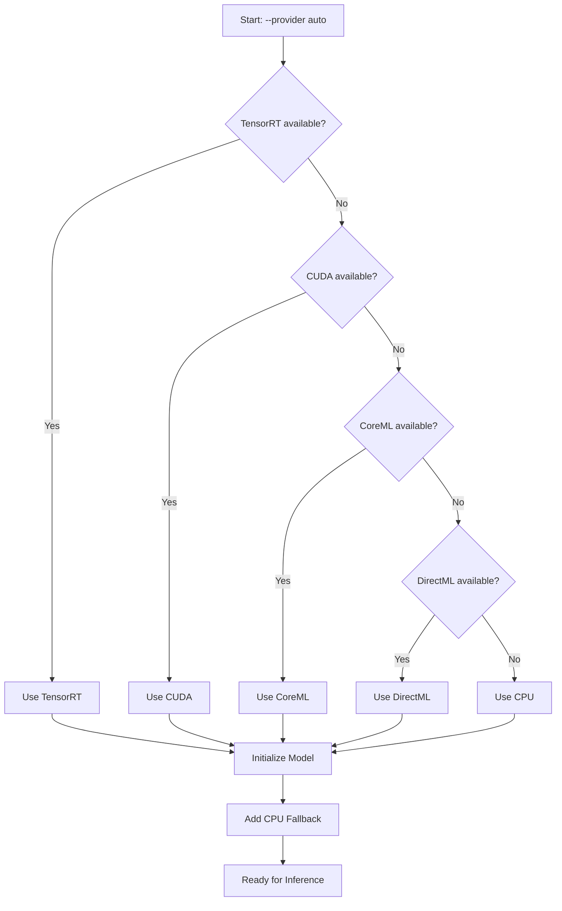
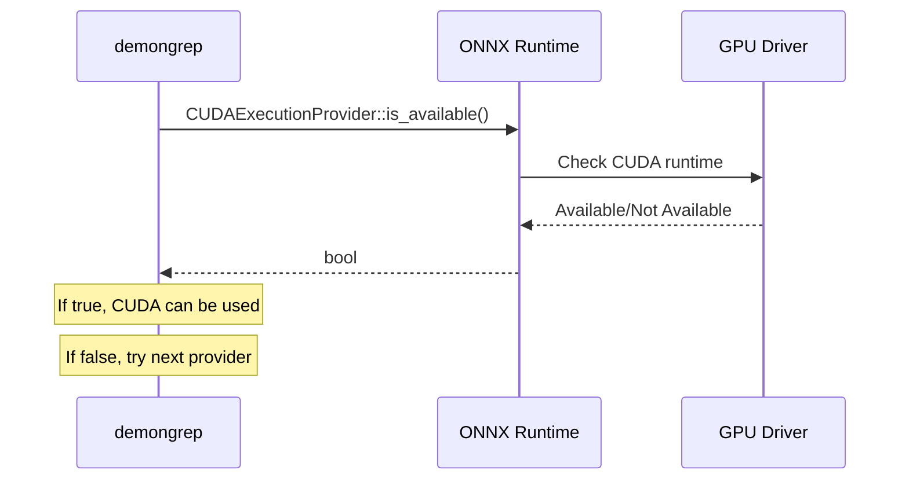
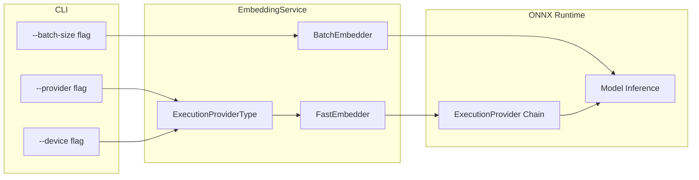
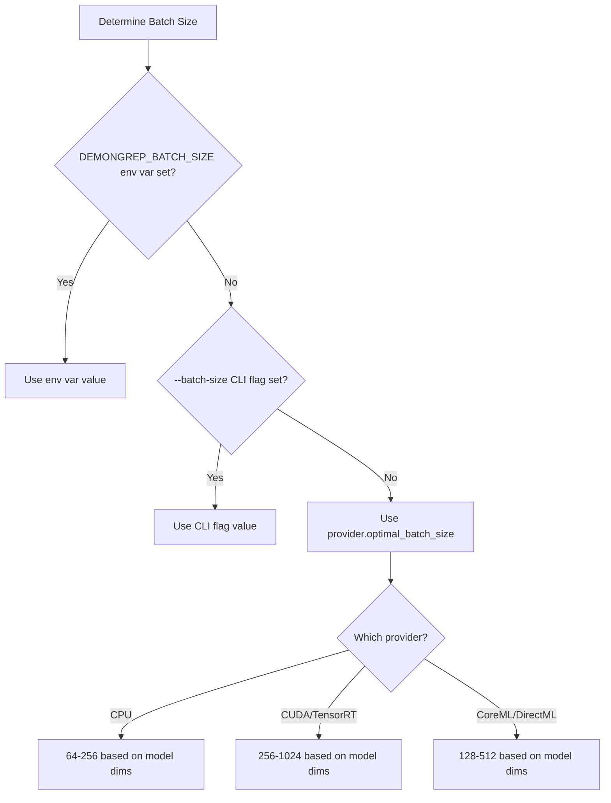
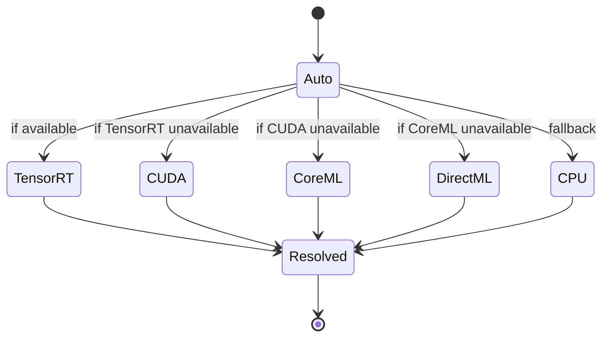
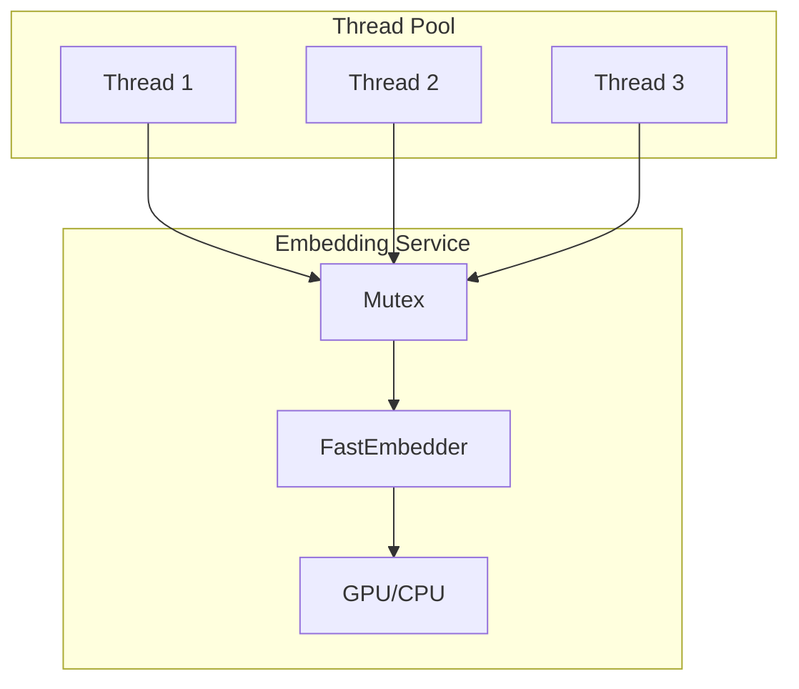

# GPU Acceleration in demongrep

This document explains how demongrep leverages GPU acceleration for embedding generation, including the provider selection logic, configuration options, and performance characteristics.

## Overview

demongrep uses ONNX Runtime execution providers to accelerate embedding generation. **By default, demongrep uses CPU** for maximum compatibility and predictable behavior. Users can explicitly enable GPU acceleration via CLI flags when needed.

### Supported Execution Providers

| Provider | Platform | Hardware | Feature Flag |
|----------|----------|----------|--------------|
| CPU | All | Any CPU | (default) |
| CUDA | Linux/Windows | NVIDIA GPU | `--features cuda` |
| TensorRT | Linux/Windows | NVIDIA GPU | `--features tensorrt` |
| CoreML | macOS | Apple Silicon | `--features coreml` |
| DirectML | Windows | Any DirectX 12 GPU | `--features directml` |

## How Provider Selection Works

### Default Behavior

By default (`--provider cpu`), demongrep uses CPU for all embedding operations. This ensures:
- Consistent behavior across all systems
- No unexpected GPU resource usage
- Backward compatibility for existing users

### Automatic Detection Flow

When `--provider auto` is explicitly specified, demongrep evaluates available providers in priority order:



### Provider Priority

The detection follows this priority order (highest to lowest):

1. **TensorRT** - NVIDIA's optimized inference engine (fastest on NVIDIA GPUs)
2. **CUDA** - NVIDIA GPU acceleration (widely compatible)
3. **CoreML** - Apple Neural Engine/GPU (macOS only)
4. **DirectML** - DirectX 12 acceleration (Windows, vendor-agnostic)
5. **CPU** - Universal fallback (always available)

### Availability Checks

Each provider is checked at runtime using ONNX Runtime's `is_available()` method:



## Architecture

### Component Interaction



### Execution Provider Chain

demongrep always configures a provider chain with CPU as fallback. This ensures graceful degradation if the primary provider fails:


Example chain for `--provider cuda`:
1. CUDA (primary)
2. CPU (fallback)

## Batch Size Optimization

Different providers have different optimal batch sizes based on their memory characteristics and parallelism capabilities.

### Batch Sizes by Provider

```mermaid
xychart-beta
    title "Optimal Batch Sizes by Provider and Model Size"
    x-axis ["384-dim", "768-dim", "1024-dim"]
    y-axis "Batch Size" 0 --> 1200
    bar [256, 128, 64] "CPU"
    bar [1024, 512, 256] "CUDA/TensorRT"
    bar [512, 256, 128] "CoreML/DirectML"
```

| Provider | Small Models (384d) | Medium Models (768d) | Large Models (1024d) |
|----------|---------------------|----------------------|----------------------|
| CPU | 256 | 128 | 64 |
| CUDA | 1024 | 512 | 256 |
| TensorRT | 1024 | 512 | 256 |
| CoreML | 512 | 256 | 128 |
| DirectML | 512 | 256 | 128 |

### Batch Size Selection Priority



## Configuration

### CLI Flags

```bash
# CPU provider (default - no flags needed)
demongrep index

# Enable automatic GPU detection
demongrep index --provider auto

# Explicit GPU provider selection
demongrep index --provider cuda --device-id 0

# Override batch size
demongrep index --provider cuda --batch-size 512

# Check available providers
demongrep doctor

# Server with GPU acceleration
demongrep serve --provider auto

# MCP server with GPU acceleration
demongrep mcp --provider cuda
```

### Environment Variables

```bash
# Override batch size (highest priority)
export DEMONGREP_BATCH_SIZE=1024
demongrep index
```

### Feature Flags at Build Time

```bash
# Build with CUDA support
cargo build --release --features cuda

# Build with multiple GPU backends
cargo build --release --features "cuda,tensorrt"

# Build for macOS with CoreML
cargo build --release --features coreml

# Build for Windows with DirectML
cargo build --release --features directml
```

## Provider-Specific Notes

### CUDA

- Requires NVIDIA GPU with compute capability 3.5+
- Needs CUDA Toolkit 11.x or 12.x installed
- cuDNN 8.x required for optimal performance
- Use `--device N` for multi-GPU systems

### TensorRT

- Built on top of CUDA (requires CUDA feature)
- Provides additional optimization through layer fusion
- First inference may be slower due to engine optimization
- Best for repeated inference workloads

### CoreML

- macOS 12.0+ required
- Automatically uses Neural Engine on Apple Silicon
- Falls back to GPU/CPU on Intel Macs
- No device selection needed

### DirectML

- Windows 10 1903+ required
- Works with any DirectX 12 compatible GPU
- Vendor-agnostic (AMD, Intel, NVIDIA)
- Use `--device N` for multi-GPU systems

## Troubleshooting

### Check Provider Availability

```bash
demongrep doctor
```

Example output:
```
demongrep system check

Default model: sentence-transformers/all-MiniLM-L6-v2 (quantized) (384 dimensions)
Default model loaded successfully

GPU Backends:

CUDA: Available
TensorRT: Not available
CoreML: Not compiled in (enable with --features coreml)
DirectML: Not compiled in (enable with --features directml)

Recommended: Cuda
```

### Common Issues

| Issue | Cause | Solution |
|-------|-------|----------|
| "CUDA device not available" | Driver not installed or outdated | Update NVIDIA drivers |
| "CoreML device not available" | macOS version too old | Update to macOS 12.0+ |
| Provider compiled but not detected | Runtime libraries missing | Install CUDA Toolkit / cuDNN |
| Slower than expected on GPU | Batch size too small | Increase `--batch-size` or let auto-detect |

### Performance Comparison

```mermaid
gantt
    title Embedding 10,000 Chunks (approximate)
    dateFormat X
    axisFormat %s

    section CPU
    Processing: 0, 60

    section CUDA
    Processing: 0, 15

    section TensorRT
    Processing: 0, 12
```



*Note: Actual performance varies by hardware, model size, and batch configuration.*

## Implementation Details

### ExecutionProviderType Enum

The `ExecutionProviderType` enum represents all supported providers:

```rust
pub enum ExecutionProviderType {
    Cpu,                              // Always available
    Cuda { device_id: i32 },          // NVIDIA GPU
    TensorRt { device_id: i32 },      // NVIDIA TensorRT
    CoreMl,                           // Apple Silicon
    DirectMl { device_id: i32 },      // DirectX 12
    Auto,                             // Auto-detect best
}
```

### Provider Resolution

The `Auto` variant is resolved at model initialization time:



### Thread Safety

The embedding service uses `Arc<Mutex<FastEmbedder>>` to allow safe concurrent access:



## Best Practices

1. **Start with defaults** - CPU works reliably everywhere; only enable GPU when needed
2. **Use `--provider auto` for large jobs** - Let demongrep pick the best available hardware
3. **Check with `doctor`** - Verify GPU is detected before enabling GPU acceleration
4. **Use appropriate batch sizes** - Larger batches benefit GPU more than CPU
5. **Consider model size** - Larger models (1024d) benefit more from GPU acceleration
6. **Multi-GPU systems** - Use `--device-id N` to select specific GPU
